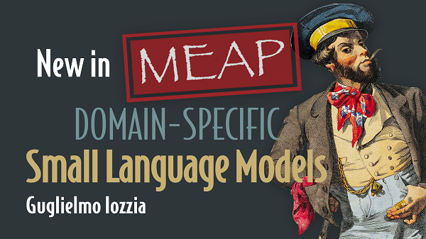

# Domain-Specific-Small-Language-Models
Repository for the companion [Colab](https://colab.research.google.com) notebooks of the [Domain-Specific Small Language Models book](https://shortener.manning.com/OwMa), Manning Publications.  
  
  
** ***Important Info*** **  
* All the notebooks in this repo have been meant for execution in the Colab free tier (with and without hardware acceleration, depending on the specific case). While the code can run on different platforms too (such as a local Jupyter/Jupyter Lab server, DeepNote, AWS SageMaker, etc.), no info is provided about setting the Python virtual environment, the required packages, specific OS configurations and GPU drivers installation and configuration other than a Colab VM. Contributions are welcome if you are running them in a different environment :wink:
* For a deeper understanding of any specific task covered here, it is recommended exploring and running the code in these notebooks while reading the corresponding book's chapters.

